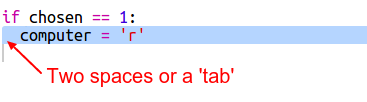

## Computer's Turn

Now it's the computer's turn. You can use the `randint` function to generate a random number to decide between rock, paper and scissors. 

  

+ Use `randint` to generate a random number to decide whether the computer has chosen rock, paper or scissors. 

  
  
+ Run your script lots of times (you'll need to enter 'r', 'p' or 's' each time.)
  
  You should see that 'chosen' is randomly set to either 1, 2 or 3. 
  
+ Let's say:
  
  + 1 = rock (r)
  + 2 = paper (p)
  + 3 = scissors (s)

  Use `if` to check if the chosen number is `1` (`==` is used to see if 2 things are the same). 
  
  
  
+ Python uses __indentation__ (moving the code to the right) to show which code is inside the `if`. You can either use two spaces (tap the spacebar twice) or tap the __tab key__ (usually above CAPSLOCK on the keyboard.)

  Set `computer` to 'r' inside the `if` using indentation:
  
  
  
+ You can add an alternative check using `elif` (short for _else if_):

  

  This condition will only be checked if the first condition fails (if the computer didn't choose `1`)
  
+ And finally, if the computer didn't choose `1` or `2` then it must have chosen `3`. 

  This time we can just use `else` which means otherwise. 
  
  
  
+ Now, instead of printing out the random number that the computer chose you can print the letter. 

   
   
   You can either delete the line `print(chosen)`, or make the computer ignore it by adding a `#` at the start of the line.
      
+ Test your code by clicking Run and choosing your option. 

+ Hmm, the computer's choice gets printed on a new line. You can fix that by adding `end=' '` after `vs`, that tells Python to end with a space instead of a new line. 

   
      
+ Play the game a few times by clicking Run and making a choice.

  For now you'll have to work out who won yourself. Next you'll add the Python code to work this out.   
  

