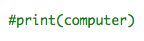
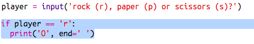

--- challenge ---
## Challenge: ASCII Art

Instead of using the letters r, p and s to represent rock, paper and scissors, can you use ASCII art?

For example:


Where:
```
rock: O
paper: ___
scissors: >8
```

+ Instead of saying `print computer` you'll need to add a new line to each of the options in the `if` to print out the correct ASCII art. 

Hints:




+ Instead of saying `print player` you'll need to add a new if statement to check which item the player chose and print out the correct ASCII art:

Hint:



Remember that adding `end=' '` to the end of a `print` makes it end with a space instead of a new line. 


--- /challenge ---